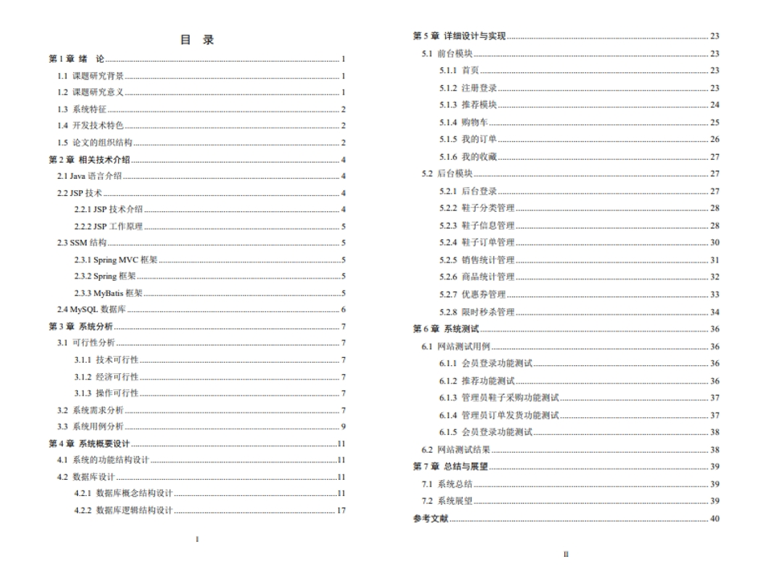

# 1.项目介绍
- 测试环境：IDEA2022，Maven3，MySQL5.7，Navicat，jdk8

- 技术栈：SpringBoot2，MyBatis，Druid，swagger，pagehelper，jsp

- 项目角色：后台管理员，会员用户

- 功能模块：门户（商品展示，商品收藏，购买，优惠券，注册登录，余额管理，个人信息），后台（用户管理，资讯管理，系统设置，账户管理等）

# 2.项目部署
- 通过navicat创建数据库shopmall， 编码utf8mb4，然后导入sql文件

- 通过idea打开项目shoeShop，根据自己本地数据库环境，修改src/main/resources/application.properties的13-16行

- 运行MainApplication

- 打开后台管理web：http://localhost:8080/shopmall/admin/login.jsp， 账号密码：admin/admin

- 后台右上角可以进入首页门户，账号密码详见huiyuan表

# 3.项目部分截图

# 4.获取方式
[戳我查看](https://gitee.com/aven999/mall)